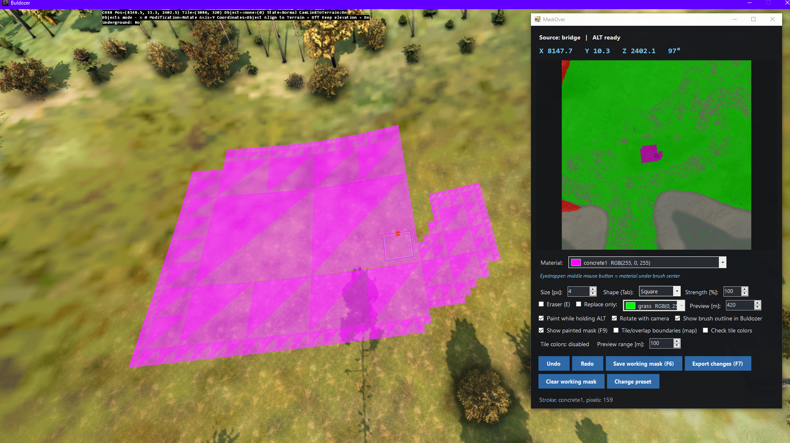
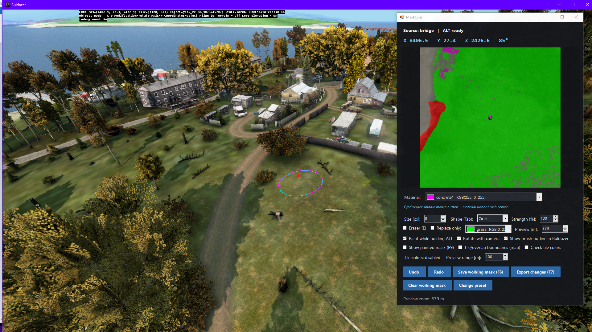
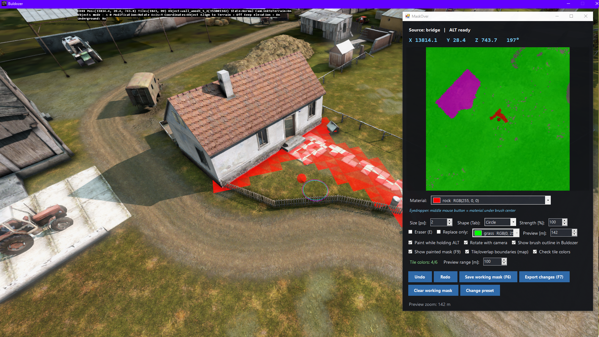

Note: This tool was created with the assistance of AI.

MaskOver may not work perfectly, but it makes working on terrain masks much easier. Use it however you like, and let’s create some amazing content for DayZ!

# MaskOver for DayZ Terrain Builder

**MaskOver** is a portable Windows overlay for painting a Terrain Builder surface mask while the target point is selected in Buldozer. It reads the world position from a small script bridge, shows a satellite/mask preview, and paints a safe working copy of the source BMP.

No hard-coded `P:\` map paths. On startup you choose an existing preset or create one. Each preset stores one editable working copy under `presets\<name>\` next to `MaskOver.exe`. The source mask, `layers.cfg` and satellite stay at their original paths and are never copied into the preset (except a one-time working copy of the mask).

---


---

## Features

- Live painting in Buldozer (hold **Alt**)
- Brush shapes: square, circle, organic; sizes **1–256 px**; strength %
- Eraser restores pixels from the original source mask
- Mask preview with zoom (**10–4000 m**), optional camera-aligned rotation
- Live brush outline drawn on the terrain
- Painted-mask preview in Buldozer (**F9**, range 10–150 m) with block merging for solid areas
- **Full mask in range** – send all mask colours around the cursor
- Middle-mouse on the full-mask preview picks the exact material colour
- Terrain Builder **tile colour limit** checks (background)
- Undo / Redo (**Ctrl+Z** / **Ctrl+Y**)
- Export full mask (BMP / PNG) and export changes only (per-layer or combined). Changed pixels are indexed in the background, so Export changes opens without a full-mask wait, and separate layer files are written from those pixels instead of copying the whole mask once per colour.
- Map **presets** – switch maps without editing paths by hand
- UI language per preset (**pl** / **en**)
- Raycast is terrain-only – trees and buildings do not pull the brush off the ground

---

## Requirements

- Windows (x64)
- .NET Framework 4.8 (usually already present on modern Windows)
- DayZ Tools / Terrain Builder + Buldozer
- Your own 24-bit surface mask (BMP / PNG), `layers.cfg`, and optionally a satellite (BMP / PNG)

The repository does **not** include map data. You supply mask / layers / satellite when creating a preset.

---

## Quick start

### 1. Build (or use a Release binary)

```powershell
.\build.ps1
```

Produces `bin\MaskOver.exe`. Or run:

```powershell
.\Start-MaskOver.ps1
```

(builds first if the EXE is missing).

### 2. Install the Buldozer bridge

Copy the ready-made script:

```text
buldozer.c  →  P:\scripts\buldozer.c
```

If you already have a custom `buldozer.c`, merge the `MaskOverCursorBridge` class and the bridge startup from the end of `BuldozerMain()` instead of overwriting your file. A minimal bridge-only snippet is also in `buldozer_bridge.c`.

### 3. Create a preset

1. Run `MaskOver.exe`.
2. Create a new preset: select source mask, `layers.cfg`, optional satellite, world size, and the real Buldozer **`$profile:`** directory (bridge files are written there).
3. Start Buldozer, then press **F10** once after every Buldozer restart.

Language for a new preset defaults to Polish; set `Language=en` in the preset config for English UI.

---

## Controls

| Input | Action |
|-------|--------|
| **Alt** (Buldozer focused) | Paint at the red point |
| **E** | Toggle eraser |
| Mouse wheel (Buldozer focused) | Brush size: 1, 2, 4, 8, 16, 32, 64, 128, 256 px |
| **[** / **]** | Brush size one step down / up |
| **+** / **-** (hold) | Zoom mask preview in / out |
| **Num0** | Reset preview zoom |
| **1–9** | Select first nine materials |
| **Ctrl+Z** / **Ctrl+Y** | Undo / Redo |
| **F6** | Export full mask (BMP or PNG) |
| **F7** | Export changes dialog |
| **F9** | Toggle painted terrain preview |
| **F10** | Reload Buldozer script (after restart) |
| Middle mouse on full-mask preview | Pick exact pixel colour / material |

Other UI options:

- **Rotate with camera** – preview top matches Buldozer heading  
- **Full mask in range** – all colours around current position (radius = preview range)  
- **Show brush outline in Buldozer**  
- **Show painted mask in Buldozer** – changed pixels in 10–150 m range; solid same-colour blocks merge into larger squares  
- **Check tile colors** – background check against Terrain Builder tile limits (configured once per preset)  
- **Clear working mask** – reset cached mask to source (after confirmation)  
- **Change preset** – restart and pick another map  

Brush always writes exact RGB values from `layers.cfg`. Lower strength paints fewer pixels; it does not blend colours.

---

## Sharing / distribution

For end users, ship:

- `MaskOver.exe`
- `buldozer.c` (or document how to install the bridge)

Presets live next to the EXE under `presets\` and can be copied with the whole folder. Source mask, satellite and `layers.cfg` are **not** bundled – each user points to their own files when creating a preset.

---

## Build notes

`build.ps1` uses the installed .NET Framework 4.8 C# compiler (`csc.exe`) and produces a single 64-bit WinForms executable. No NuGet packages.

Alternatively open `MaskOver.csproj` in Visual Studio / MSBuild (all source files are listed).

---

## Project layout

```text
MaskOver/
├── src/                  C# sources
├── build.ps1             Compile → bin\MaskOver.exe
├── Start-MaskOver.ps1    Build if needed, then run
├── MaskOver.csproj       MSBuild project
├── buldozer.c            Ready-to-use Buldozer script (bridge included)
├── buldozer_bridge.c     Bridge-only snippet for merging into an existing script
├── INSTRUCTIONS_EN.txt   Short English install + controls
├── INSTRUKCJA_PL.txt     Short Polish install + controls
├── LICENSE               
└── README.md
```

---

## License
Freeware - Proprietary / All Rights Reserved.  
See [LICENSE.txt](LICENSE.txt) for details.

---


